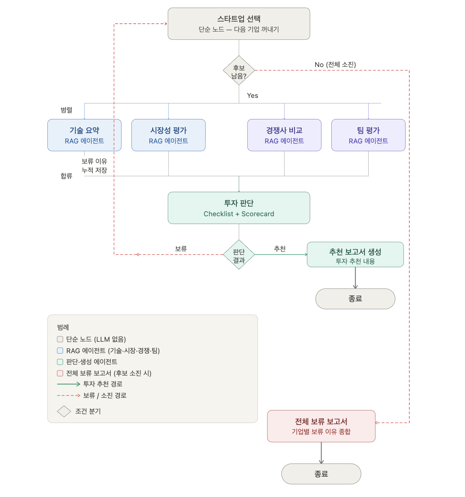

# Supply Chain Startup Investment Evaluation Agent

본 프로젝트는 Supply Chain 스타트업에 대한 투자 가능성을 자동으로 평가하는 멀티 에이전트 시스템입니다.

## Overview

- **Objective** : Supply Chain 스타트업의 기술력, 시장성, 경쟁 우위, 팀 역량을 기준으로 투자 적합성 분석
- **Method** : Multi-Agent + Agentic RAG (LangGraph 기반 워크플로우)
- **Tools** : LangGraph, FAISS, BGE-M3, GPT-4o-mini

## Features

- PDF 자료 기반 정보 추출 (기술 리포트, 시장 분석, 경쟁사 비교, 팀 보고서)
- 체크리스트 기반 정량 평가 (카테고리별 5문항 × 4개 영역)
- 가중 스코어링 투자 판단 (팀 35%, 시장 30%, 기술 20%, 경쟁 15%)
- 투자 추천 보고서 / 전체 보류 보고서 자동 생성

## Tech Stack

| Category       | Details                      |
| -------------- | ---------------------------- |
| Framework      | LangGraph, LangChain, Python |
| LLM            | GPT-4o-mini via OpenAI API   |
| Embedding      | BAAI/bge-m3                  |
| Vector Store   | FAISS                        |
| Retrieval 검증 | Hit Rate@K, MRR              |

## Agents

| #   | Agent       | 유형      | 설명                                    |
| --- | ----------- | --------- | --------------------------------------- |
| 1   | 기술 요약   | RAG Agent | 제품/기술력 체크리스트 평가 (20%)       |
| 2   | 시장성 평가 | RAG Agent | 시장 규모·성장성 체크리스트 평가 (30%)  |
| 3   | 경쟁사 비교 | RAG Agent | 경쟁 우위·차별점 체크리스트 평가 (15%)  |
| 4   | 팀 평가     | RAG Agent | 창업자·팀 역량 체크리스트 평가 (35%)    |
| 5   | 투자 판단   | LLM Agent | 4개 결과 종합 스코어링 + 추천/보류 판단 |
| 6   | 보고서 생성 | LLM Agent | 투자 추천 보고서 또는 보류 보고서 생성  |

## Architecture



## Retrieval 성능 검증

| Metric     | 설명                                | 결과 |
| ---------- | ----------------------------------- | ---- |
| Hit Rate@4 | 상위 4개 검색 결과에 정답 포함 비율 | TBD  |
| MRR        | 정답 문서의 평균 역순위             | TBD  |

## Directory Structure

```
├── data/                          # 스타트업 mock DB (startups.json)
├── docs/                          # 평가용 PDF 문서 (4종)
├── vectorstore_index/             # FAISS 인덱스 (에이전트별)
├── scripts/
│   └── ingest.py                  # PDF → FAISS 적재
├── src/
│   ├── agents/
│   │   ├── router.py              # 스타트업 선택 라우터
│   │   ├── tech_summary.py        # 기술 요약 에이전트
│   │   ├── market_eval.py         # 시장성 평가 에이전트
│   │   ├── competitor.py          # 경쟁사 비교 에이전트
│   │   ├── team_eval.py           # 팀 평가 에이전트
│   │   ├── investment.py          # 투자 판단 에이전트
│   │   └── report.py              # 보고서 생성 에이전트
│   ├── graph/
│   │   └── workflow.py            # LangGraph 워크플로우
│   ├── schemas/
│   │   ├── state.py               # InvestmentState 정의
│   │   └── output.py              # 에이전트 출력 포맷
│   ├── vectorstore/
│   │   ├── embeddings.py          # BGE-M3 임베딩
│   │   ├── loader.py              # PDF 로더 + 청킹
│   │   └── store.py               # FAISS 생성/로드
│   └── config.py                  # 전역 설정
├── main.py                        # 실행 엔트리포인트
├── requirements.txt
└── README.md
```

## Setup

```bash
# 1. 가상환경 생성 및 활성화
python -m venv .venv
source .venv/bin/activate

# 2. 패키지 설치
pip install -r requirements.txt

# 3. 환경변수 설정
cp .env.example .env
# .env 파일에 OPENAI_API_KEY 입력

# 4. FAISS 인덱스 적재
python -m scripts.ingest

# 5. 실행
python main.py
```

## Contributors

| 이름   | 담당                             |
| ------ | -------------------------------- |
| 김은비 | 라우터 + 워크플로우 + 문서 청킹  |
| 임유경 | 기술 요약 + 시장성 평가 에이전트 |
| 나현서 | 경쟁사 비교 + 팀 평가 에이전트   |
| 김상현 | 투자 판단 + 보고서 생성 에이전트 |
